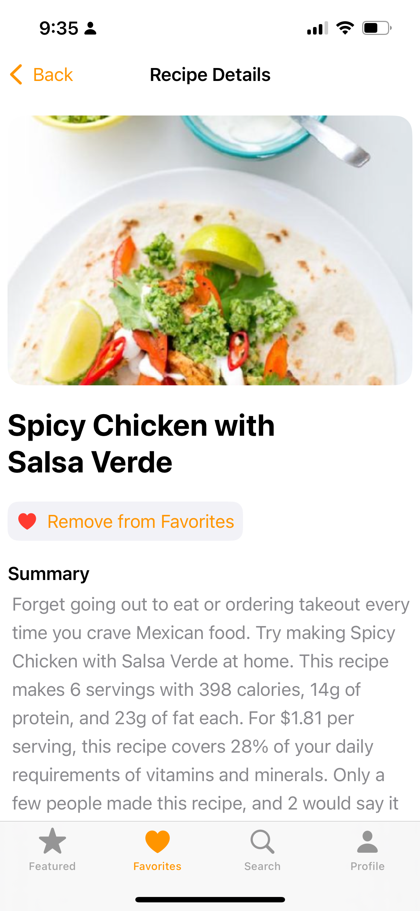
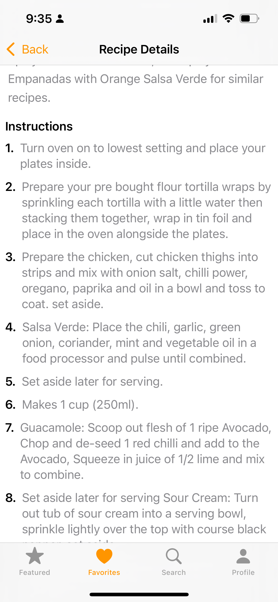
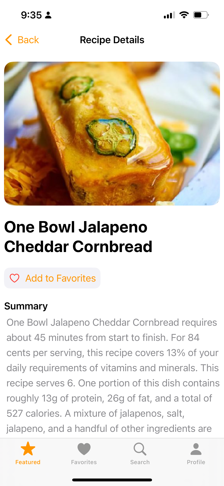

# Forkly

Forkly is a delightful iOS recipe app that helps you discover, search, and save your favorite recipes. Built with SwiftUI and Firebase, Forkly provides a seamless experience for food enthusiasts to explore new dishes and keep track of their culinary adventures.

## Project Evolution

Forkly v2 is a complete rewrite and significant enhancement of the original Forkly app, which began as an academic project. This second version brings several major improvements:

- **Full MVVM Architecture**: While the original followed basic MVVM concepts, v2 implements a comprehensive MVVM pattern with proper separation of concerns
- **Firebase Integration**: Added cloud database connectivity and user authentication through Firebase (not present in v1)
- **Comprehensive Testing**: Introduced extensive unit tests for all ViewModels and business logic
- **Enhanced UI/UX**: Improved user interface with more intuitive navigation and visual appeal
- **Advanced Error Handling**: Robust error handling and user feedback mechanisms
- **Performance Optimizations**: Improved loading times and reduced API calls through caching
- **Code Documentation**: Added thorough code documentation with comments, DocC-style documentation, and MARK annotations (completely absent in v1)

This evolution represents a significant step forward in both functionality and code quality from the original academic implementation.

## Features

- **User Authentication**: Secure sign-up and login functionality using Firebase Authentication
- **Cloud Storage**: Synchronize favorites across devices using Firestore
- **Featured Recipes**: Discover new and exciting recipes on the home screen
- **Search Functionality**: Find recipes by name, ingredients, or cuisine
- **Detailed Recipe View**: Get comprehensive information including ingredients, instructions, and nutritional information
- **Favorites System**: Save your favorite recipes for quick access
- **Clean UI**: Beautiful and intuitive user interface designed with SwiftUI
- **Unit Tests**: Comprehensive test suite for ViewModels and business logic

## Live Demo
[
](https://youtube.com/shorts/4uV8Max4Z3g?si=iQDNe1CkpZA3GzZ0)

## Screenshots

The `Screenshots` directory contains images of the app in action. These screenshots showcase the main features of Forkly:

<div align="center">
  <h3>Initial Loading Screen</h3>
  
  <p>The app's initial loading screen when first launched.</p>
  
  <h3>Login Screen</h3>
  
  <p>The Login screen provides secure authentication for users.</p>
  
  <h3>Favorites Screen</h3>
  
  <p>The Favorites screen displays the user's saved recipes.</p>
  
  <h3>Featured Recipes</h3>
  
  <p>The Featured Recipes screen displays a curated selection of recipes for users to explore.</p>
  
  <h3>Search Screen with Filters</h3>
  
  <p>The Search screen allows users to find recipes by name, ingredients, or cuisine type with filtering options.</p>
  
  <h3>Real Device Screenshots - Recipe Details</h3>
  <div style="display: flex; justify-content: center; gap: 10px;">
    
    
    
  </div>
  <p>Recipe detail screens running on a real iOS device.</p>
</div>

To add new screenshots:
1. Run the app in the iOS Simulator or on a real device
2. Take screenshots using Cmd+S (Simulator) or Power+Volume Up (real device)
3. Move the screenshots to the `Screenshots` directory
4. Reference them in this README using HTML img tags with width attribute for smaller display:
   ```html
   
   ```

## Architecture

Forkly is built using a robust MVVM (Model-View-ViewModel) architecture pattern:

- **Models**: Data structures that represent recipes and recipe details
- **Views**: SwiftUI views for displaying the user interface
- **ViewModels**: Business logic and data processing components
- **Services**: API integration with the Spoonacular recipe database and Firebase services
- **Utilities**: Helper functions and extensions for common tasks

The app follows MVVM best practices with:
- Clear separation of concerns
- Reactive UI updates using SwiftUI's @Published properties
- Consistent error handling throughout the app
- Dependency injection for better testability
- Asynchronous operations for smooth user experience

## Technical Details

- **Swift & SwiftUI**: Built with Swift and SwiftUI for a modern, declarative UI
- **Firebase Authentication**: Secure user authentication system
- **Cloud Firestore**: NoSQL database for storing and syncing user favorites
- **Combine Framework**: Used for reactive programming patterns
- **API Integration**: Uses the Spoonacular API with a custom error handling system
- **Persistence**: Saves favorites using both Firestore (when online) and UserDefaults (local fallback)
- **Async Image Loading**: Efficiently loads and caches recipe images
- **Custom Fonts**: Uses the Pacifico font for stylish headings
- **Unit Testing**: Comprehensive tests for ViewModels using Apple's Testing framework

## Firebase Integration

Forkly integrates with Firebase to provide:

- **User Authentication**: Email/password authentication with secure storage
- **Firestore Database**: Cloud storage of user favorites with real-time updates
- **Offline Support**: Local caching for offline access to favorites
- **Profile Management**: User profile information and settings

### Firebase Setup

The app uses the following Firebase services:
- Firebase Authentication
- Cloud Firestore
- Firebase Analytics (optional)

## API Integration

Forkly uses the [Spoonacular API](https://spoonacular.com/food-api) for recipe data. The app includes the following API endpoints:

- Search recipes by query
- Get detailed recipe information
- Fetch random featured recipes
- Find recipes by ingredients

All API calls use a consistent Result type pattern with dedicated error handling.

### Search Functionality

Forkly implements an intelligent search system with two different search methods:

1. **Query-Based Search**: When users enter a text query, the app uses Spoonacular's complex search endpoint to find recipes matching the query text and any selected filters.

2. **Ingredients-Based Search**: When users enter ingredients without a text query, the app automatically switches to the findByIngredients endpoint, which is optimized for finding recipes that use specific ingredients.

This dual approach provides better search results based on how users interact with the app:
- Looking for a specific dish? Use text search
- Have ingredients and want recipe ideas? Just add the ingredients without a query

The search system also supports advanced filtering options including:
- Cuisine type (Italian, Mexican, etc.)
- Diet restrictions (Vegetarian, Gluten-Free, etc.)
- Intolerances (Dairy, Nuts, etc.)
- Meal type (Breakfast, Main Course, etc.)
- Maximum preparation time
- Sort options (Popularity, Healthiness, etc.)

### Spoonacular API Notes

The Spoonacular API has usage limits based on your subscription plan:
- Free tier: Limited to 150 points per day
- Paid tiers: Higher limits with better reliability

If you encounter issues like "Network connection was lost" errors, consider:
1. Upgrading to a paid tier for more reliable service
2. Checking your daily quota usage
3. Using the app's built-in caching to reduce API calls

## Project Structure

The actual project structure is as follows:

```
Forkly/
├── Forkly-v2/
│   ├── Assets.xcassets/        # App images and colors
│   ├── Fonts/                  # Custom fonts (Pacifico)
│   ├── Models/                 # Data models
│   │   ├── Recipe.swift
│   │   └── RecipeDetail.swift
│   ├── Views/                  # SwiftUI views
│   │   ├── ContentView.swift
│   │   ├── FavoritesView.swift
│   │   ├── FeaturedRecipesView.swift
│   │   ├── LoadingView.swift
│   │   ├── LoginView.swift
│   │   ├── ProfileView.swift
│   │   ├── RecipeCardView.swift
│   │   ├── RecipeDetailLoaderView.swift
│   │   ├── RecipeDetailView.swift
│   │   └── SearchView.swift
│   ├── ViewModels/             # Business logic
│   │   ├── FavoritesManager.swift
│   │   ├── FeaturedRecipesViewModel.swift
│   │   ├── RecipeDetailViewModel.swift
│   │   └── RecipeSearchViewModel.swift
│   ├── Services/               # API and Firebase services
│   │   ├── AuthManager.swift
│   │   └── RecipeAPIService.swift
│   ├── Utilities/              # Helper functions and extensions
│   │   ├── ApiKeys.template.swift
│   │   ├── PreviewHelpers.swift
│   │   └── StringUtilities.swift
│   ├── Forkly_v2App.swift      # App entry point
│   ├── Info.plist              # App configuration
│   ├── GoogleService-Info.template.plist # Firebase template
│   └── setup.sh                # Setup script
│
├── Forkly-v2Tests/             # Unit tests
│   ├── Mocks/                  # Mock objects for testing
│   │   ├── MockRecipeAPIService.swift
│   │   └── MockFavoritesManager.swift
│   └── ViewModels/             # ViewModel tests
│       ├── FavoritesManagerTests.swift
│       ├── FeaturedRecipesViewModelTests.swift
│       ├── RecipeDetailViewModelTests.swift
│       └── RecipeSearchViewModelTests.swift
│
├── Screenshots/                # App screenshots for documentation
├── README.md                   # Project documentation
└── run_tests.sh               # Script to run all tests
```

## Unit Testing

Forkly includes comprehensive unit tests for all ViewModels and business logic components. The test suite uses Apple's Testing framework and follows best practices:

### Test Structure

Each test follows the Arrange-Act-Assert pattern:
- **Arrange**: Set up the test environment and mock dependencies
- **Act**: Perform the action being tested
- **Assert**: Verify the expected outcome using XCTest assertions

### Mock Objects

The test suite includes mock implementations of key services:

- **MockRecipeAPIService**: Simulates API responses without making actual network calls
- **MockFavoritesManager**: Provides a testable implementation of the favorites system

### Running Tests

To run the tests:
1. Open the project in Xcode
2. Select the "Forkly-v2" scheme
3. Press Cmd+U or select Product > Test

Alternatively, use the included script:
```bash
./run_tests.sh
```

## Getting Started

### Prerequisites

- Xcode 14.0 or later
- iOS 16.0 or later
- Swift 5.7 or later
- Active internet connection for recipe data and Firebase services
- Firebase account (for authentication and database features)
- Spoonacular API key (free or paid tier)

### Installation

1. Clone the repository:
   ```bash
   git clone https://github.com/yourusername/Forkly.git
   cd Forkly
   ```

2. Set up Firebase:
   - Create a Firebase project at [firebase.google.com](https://firebase.google.com)
   - Add an iOS app to your Firebase project
   - Download the `GoogleService-Info.plist` file and add it to your Xcode project in the Forkly-v2 directory
   - Enable Email/Password authentication in the Firebase console
   - Create a Firestore database in the Firebase console

3. Get a Spoonacular API key:
   - Create an account at [spoonacular.com](https://spoonacular.com/food-api)
   - Subscribe to a plan (free tier available)
   - Copy your API key from your dashboard

4. Run the setup script to create necessary configuration files:
   ```bash
   ./setup.sh
   ```
   This script will:
   - Create `ApiKeys.swift` from the template if it doesn't exist
   - Check for the presence of `GoogleService-Info.plist`
   - Guide you through the remaining setup steps

5. Open the project in Xcode:
   ```bash
   open Forkly-v2.xcodeproj
   ```

6. Edit `Forkly-v2/Utilities/ApiKeys.swift` to add your actual Spoonacular API key:
   ```swift
   struct ApiKeys {
       static let spoonacularApiKey = "your_actual_api_key_here"
   }
   ```

7. Build and run the app on your simulator or device.

## Usage

- **Sign Up/Login**: Create an account or log in to access personalized features
- **Browse Featured Recipes**: Open the app and explore the featured recipes on the home tab
- **Search for Recipes**: Tap the search tab, enter keywords, and find recipes that match your criteria
- **Save Favorites**: Tap the heart icon on any recipe to save it to your favorites (synced across devices)
- **View Recipe Details**: Tap on any recipe card to view detailed information, including instructions and ingredients
- **Manage Profile**: Access your profile to view account information or sign out

## Development Notes

### Testing

- **Unit Tests**: Run the test suite to verify ViewModel functionality
- **UI Testing**: Use the simulator for testing the full app flow with Firebase integration
- **Component Testing**: Individual UI components can be tested in isolation
- **SwiftUI Previews**: Work for components that don't rely on Firebase

### Common Issues

- **Firebase Initialization**: Firebase should only be initialized once in the app lifecycle
- **Preview Crashes**: Views that depend on Firebase services may crash in preview mode
- **Authentication State**: Always check authentication state before accessing user-specific data
- **API Rate Limiting**: Spoonacular API has usage limits that may cause errors if exceeded

### Troubleshooting

- **API Connection Issues**: If you encounter "Network connection was lost" errors, check your Spoonacular API quota and consider upgrading your plan
- **Firebase Authentication Errors**: Ensure your Firebase project has Email/Password authentication enabled
- **Missing API Keys**: Make sure you've properly set up the ApiKeys.swift file with your Spoonacular API key
- **Build Errors**: Ensure all required files are in place, including GoogleService-Info.plist

## Future Enhancements

- Social authentication (Google, Apple, Facebook)
- Ingredient-based search
- Dietary filters (vegetarian, vegan, gluten-free, etc.)
- Meal planning functionality
- Shopping list generation
- Social sharing features
- UI tests for critical user flows
- Expanded test coverage for edge cases

## License

This project is licensed under the MIT License - see the LICENSE file for details.

## Acknowledgements

- [Firebase](https://firebase.google.com) for authentication and database services
- [Spoonacular API](https://spoonacular.com/food-api) for providing recipe data
- [Pacifico Font](https://fonts.google.com/specimen/Pacifico) by Vernon Adams
- All the amazing chefs and food bloggers whose recipes inspire us

---

Created by Juan Rodriguez - 2025

### Featured Recipes

The app's featured recipes section uses a robust approach to ensure users always see content:

1. **Primary Method**: First attempts to fetch random recipes using the exact parameters that work with the Spoonacular API.

2. **Fallback Mechanism**: If the random recipes endpoint fails, the app automatically falls back to the findByIngredients endpoint with a set of common ingredients.

This dual-endpoint strategy ensures that even if one API endpoint is experiencing issues or rate limiting, users will still see recipe recommendations. The app also implements caching to reduce API calls and improve performance.

